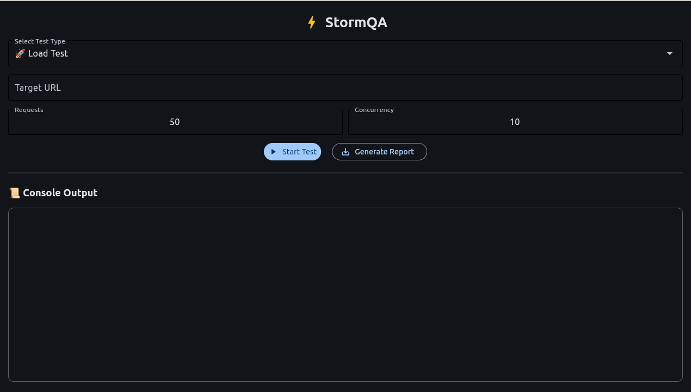

# StormQA ⚡️

A zero-config, powerful, and developer-friendly tool for performance testing. StormQA automates Load, Network, and Database tests directly from your terminal or through a clean graphical user interface.

---

## ✨ Features

-   **Zero-Configuration**: No complex setup files. Run tests instantly with simple commands.
-   **Automated Load & Stress Testing**: Simulate concurrent users and measure advanced performance metrics.
-   **Network Condition Simulation**: Test your application's resilience under high latency and packet loss.
-   **Simulated Database Testing**: Safely check your backend's health without touching the real database.
-   **Dual Interface**: A fast and scriptable **CLI** and an intuitive **GUI**.
-   **Comprehensive Reporting**: Generate JSON, CSV, or PDF reports from your latest test runs.

---

## 🚀 Installation

Follow these steps to get StormQA running on your local machine.

#### 1️⃣ **Create a Virtual Environment**
It's recommended to create a separate virtual environment for the project.
```bash
python3 -m venv venv
```

#### 2️⃣ **Activate the Environment**
-   On **Linux/macOS**:
    ```bash
    source venv/bin/activate
    ```
-   On **Windows**:
    ```bash
    .\venv\Scripts\activate
    ```

#### 3️⃣ **Install StormQA**
Install the latest version of StormQA directly from PyPI.
```bash
pip install --upgrade stormqa
```

---

## 🎯 Getting Started

After installation, the best way to start is by running the `start` command for a detailed guide:
```bash
stormqa start
```

For a visual and interactive experience, launch the GUI with a simple command:
```bash
stormqa open
```


---

## 📚 CLI Command Reference

-   `stormqa start`: Displays the welcome message and detailed command guide.
-   `stormqa open`: Launches the graphical user interface.
-   `stormqa load <SITE_URL>`: Runs a performance load test.
-   `stormqa network <SITE_URL>`: Simulates poor network conditions.
-   `stormqa db <SITE_URL>`: Discovers and tests common API endpoints.
-   `stormqa report`: Generates a consolidated report.

*Use `stormqa [COMMAND] --help` for a full list of options for each command.*